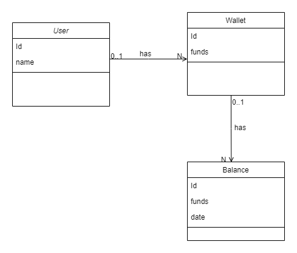

# Wallet Challenge

This project was built using the **Java** language and **Spring Boot framework**. The **MVC architecture** was chosen to
support the requirements and provides a **REST** API interface to provide the wallet service.

The architecture has the REST layer containing the controller wallet class, the service layer that has all the
business logic of the application, and the repository layer containing the SQL queries to be executed on the **Postgres** database. Particularly in the
repository layer, it was used the **Spring-Data** framework that manages all the stuff related to connection management and transactions management.

Below it can be seen a diagram of the main concepts involved.



Some considerations were adopted to guarantee the well function of the application:

1) Each transfer, withdraw and deposit operation has to create a balance registry in the history of balance of the wallet.
   To guarantee the correctness of the data, if any step of the operations fails, all the operation will be undone using the
   **@Transaction** annotation.

2) Considering the current balance operation is executed often, I have put the current fund of the wallet in the wallet
   itself to avoid to do a join SQL operation with the Balance history on each query. But the current funds were also put
   in the balance history to be present in aggregated reports.

3) If negative amounts were sent to the service, an error will be returned indicating the reason.

In order to run the application, first create a **.jar** file executing the **Maven** command below (it can be done by any IDE):

```
 mvn clean install
```

After that, run the application using the command:

```
java -jar wallet-1.0.jar
```

If you want to execute the tests before installing the application, run the following command:

```
mvn test
```

The test class [WalletApplicationTests.java](src/test/java/com/chalenge/wallet/WalletApplicationTests.java) uses the **MocMvc** class to test the web layer only and can
also be executed manually using an IDE.

I have spent almost **7 bours** in total to design and implement the application.

I hope you all like the project!! God bless you!!
